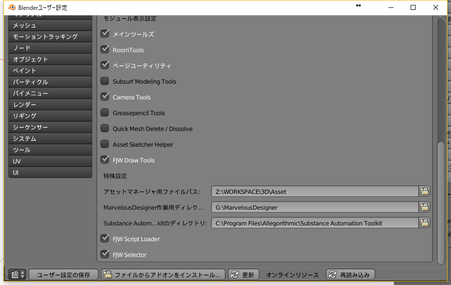
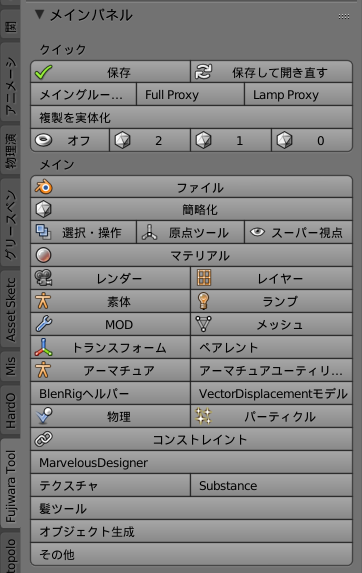
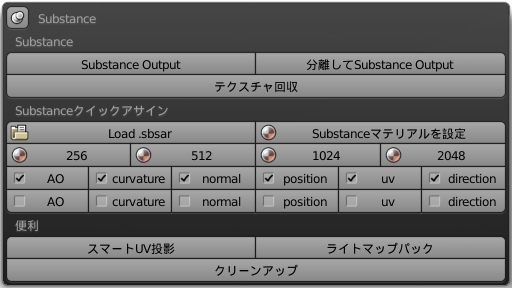
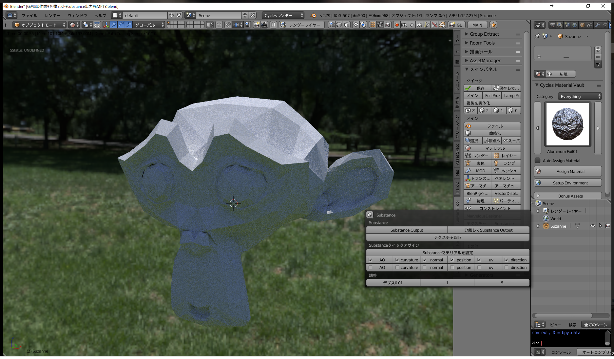
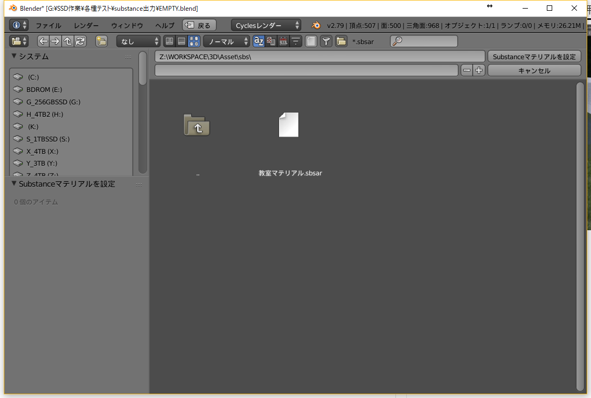
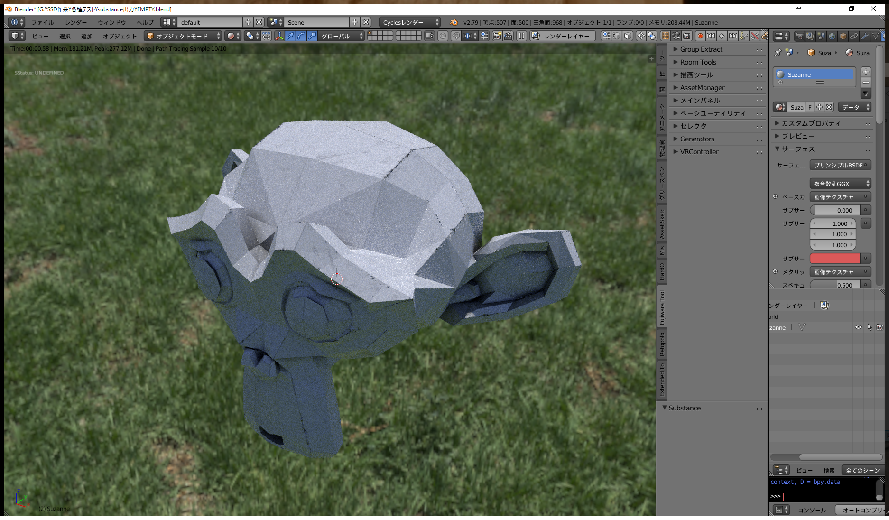
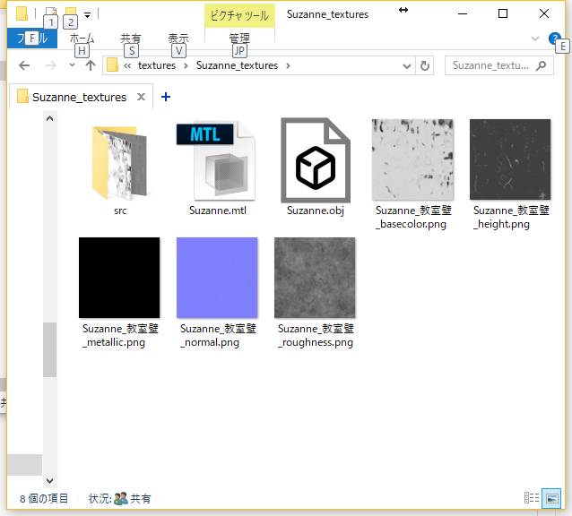

# Substance関連機能

## 設定

アドオン設定で
* アセットマネージャ用ファイルパス
* Substance Automation Toolkitディレクトリ
を設定しておく必要がある。

## 場所
メインパネル→Substance

## 機能
### Substance
* Substance Output  
    Substance作業用の便利機能。objを出力して、そのフォルダを表示する。fujiwara_toolbox/resources/EMPTY.sbsをコピーしてくる。
* テクスチャ回収  
    texturesフォルダからbasecolorやroughnessなどのテクスチャを回収して、マテリアルにまとめる。

### Substanceクイックアサイン
* Substanceマテリアルを設定  
    ファイルブラウザから.sbsarファイルを選択すると、自動的にマップが出力やレンダがされて、結果をマテリアルに回収できる。  
    .sbsarは、"アセットマネージャ用ファイルパス/sbs/"フォルダにおいておく。  
    ベイクするモデル情報は、下のボタンで設定する。設定はオブジェクトのカスタムプロパティに維持される。
    何もしなかった場合、ambient-occlusionとcurvatureがベイクされる。

## identifier
Substance上でinputに設定するidentifierのうち、有効なのは以下の通り。

* ambient-occlusion
* curvature
* normal-world-space
* position
* uv-map
* world-space-direction

## 複数のマテリアル
一つの.sbsarに複数のマップがある場合、生成まではできるが回収はうまくいかない。

## 使い方
アサインしたいオブジェクトをアクティブにする。  
使いたい.sbsarで必要なマップがある場合は、AOとかcurvatureのボタンを押して設定する。

"Substanceマテリアルを設定"を押すとファイルブラウザが表示されるので、.sbsarファイルを選択する。

しばらく待つと、オブジェクトにテクスチャがアサインされる。

生成されたデータは、"textures/オブジェクト名_textures"内に保存されている。"src"内には、オブジェクトからベイクしたマップが保存されている。

