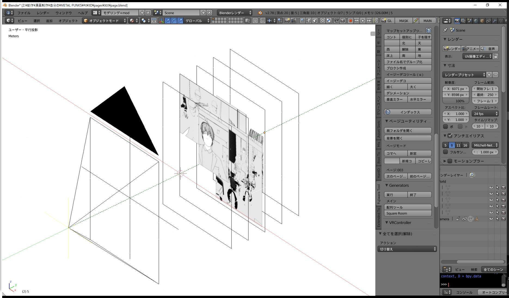
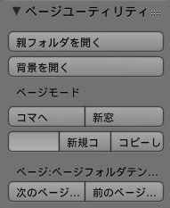
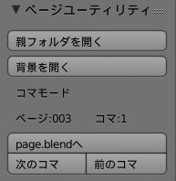
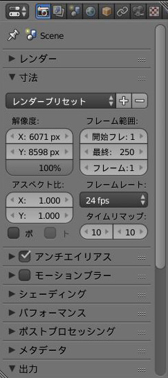
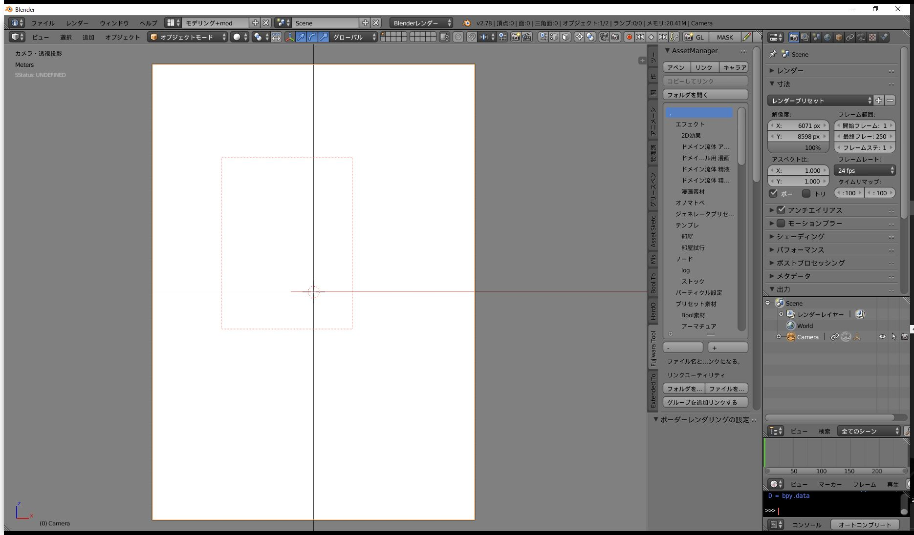
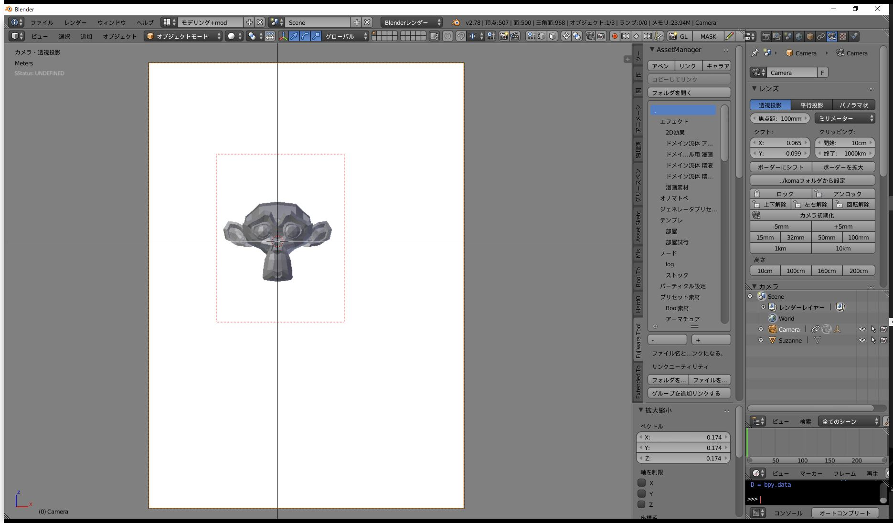
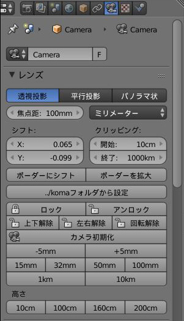
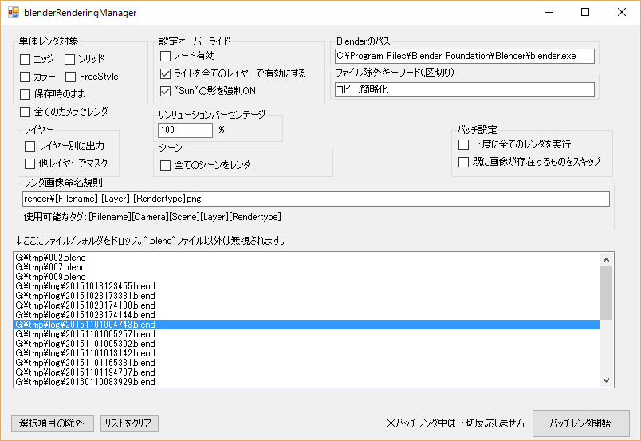

# ページユーティリティ

[READMEに戻る](README.md)

漫画用ページユーティリティです。  
コマごとのプレビューを"page.blend"内にまとめて、一度にページの様子を確認することができます。
コマのコピーや生成もできるので、サクサクページ作業を進めることができます。

## このアドオンを使用する利点
現状漫画でのBlender運用は三者三様に工夫している状態で、現場ごとにやり方が全く違い可搬性がありません。  
このアドオンを使用しワークフローを共通化することで、データが汎用性を持ちます。誰に頼んでも、どこにいっても共通した方法で製作ができますし、データも交換可能になるというメリットがあります。
また、このアドオンがサポートするのは運用面だけなので、画作りが縛られることもありません。

## 使い方
### 準備
"fujiwara_toolbox\テンプレート\3Dページ作業用テンプレ"を3D作業をしたい場所にコピーします。

テンプレの中身  

    3Dページ作業用テンプレ
        models:リンクで使用するモデルを入れると便利
        pages:この中で各ページの作業をする
            000ページフォルダテンプレ
                render:ここにレンダ画像をいれるとよい
                background.png
                page.blend

"pages"フォルダに、Clipstudio Paint等から書き出した各ページの画像を配置します。
    
    例：  
    第10話3D作業
        models/
        pages/
            なんとか伝第10話_001.png
            なんとか伝第10話_002.png
            なんとか伝第10話_003.png
            なんとか伝第10話_004_005.png
            なんとか伝第10話_006.png
            なんとか伝第10話_007.png
            000ページフォルダテンプレ/
                render/
                background.png
                page.blend

"000ページフォルダテンプレ"内の"page.blend"を起動して、"ページ展開"をクリックします。自動的にページフォルダが展開されて、作業準備が完了します。

    例：  
    第10話3D作業/
        models/
        pages/
            なんとか伝第10話_001.png
            なんとか伝第10話_002.png
            なんとか伝第10話_003.png
            なんとか伝第10話_004_005.png
            なんとか伝第10話_006.png
            なんとか伝第10話_007.png
            000ページフォルダテンプレ/
            001/
            002/
            003/
            004_005/
            006/
            007/
    ※各フォルダの内容は省略。

### 各ページ作業
使いたいページの"page.blend"を起動します。

### ページモード

"page.blend"上では、ページモードとして機能する。ページモードでは以下のことができます。
* 親フォルダを開く  
この.blendファイルがあるフォルダをエクスプローラで開く。(Windowsのみ)

* 背景を開く  
このフォルダ内のbackground.pngを開く。（Windowsのみ）

* ページ展開  
現在開いているpage.blendのフォルダをテンプレとして、親フォルダ内にある画像を使って自動的にページフォルダを展開します。既存のフォルダは無視されます。pngが推奨です。png以外でも展開できますが、各フォルダのbackground.pngとしてコピーされません。

* コマへ  
3Dビューで選択しているコマに移動する。

* 新窓  
新しいblenderを立ち上げてコマを開く。

* 入力欄  
新規コマ作成時に使用する名前。半角数値推奨。文字列も入れられる。

* 新規コマ  
入力欄が空の場合、連番で自動的に新しいコマを作成して開く。入力があった場合は、その名前でコマを作成する。作成しようとしたコマが既にあった場合はそのコマを開く。

* コピーして新規コマ  
3Dビュー上で選択しているコマをコピーして、コマを作成する。

* 次のページ  
次のページフォルダ内の"page.blend"を開く。

* 前のページ  
前のページフォルダ内の"page.blend"を開く。

**コマ・ページ移動の際には自動的に内容が保存されます。**

### コマモード

"page.blend"以外ではコマモードとして機能する。コマモードでは以下のことができます。

* 親フォルダを開く  
この.blendファイルがあるフォルダをエクスプローラで開く。(Windowsのみ)

* 背景を開く  
このフォルダ内のbackground.pngを開く。（Windowsのみ）

* page.blendへ  
このフォルダのpage.blendを開く。
この際、コマのプレビュー画像が生成される。はじめに軽量なOpenGLレンダでの画像が生成され、あとでバックグラウンドでレンダされたプレビューに置き換わる。OpenGLレンダではカメラのボーダー設定が有効にならないので、びっくりしないように。

* 次のコマ  
次のコマファイルを開く。

* 前のコマ  
前のコマファイルを開く。

### テンプレートのカスタマイズ

デフォルトの"page.blend"とコマのテンプレートは藤原佑介専用なので、使いにくい人もいると思います。
それぞれ、以下の.blendファイルを差し替えることで変更できます。

    page.blend
        fujiwara_toolbox\テンプレート\3Dページ作業用テンプレ\pages\ページフォルダテンプレ\page.blend
    コマテンプレート
        fujiwara_toolbox\resources\pageutils\cell.blend

## 便利な使い方
### 解像度設定

"プロパティパネル"の"寸法"内で解像度設定をすることができます。
書き出した画像と同じ寸法と同じにしておきましょう。"page.blend"と"cell.blend"両方で設定しておきましょう。
"レンダープリセット"の横の"+"ボタンを押すと、設定した値をプリセットとして保存することができて便利です。

### レンダーボーダー

カメラビュー（ショートカット：テンキー0）でCtrl + Bを押してドラッグすると、レンダーボーダーを設定できます。（画像の赤い点線）
レンダーボーダーを設定するとこの範囲内だけをレンダリングすることができます。範囲が制限されるのでレンダリングも速くなります。各コマで必要な範囲を設定しましょう。

### カメラのレンズシフト

カメラを選択すると、プロパティパネルにカメラの詳細設定が現れます。

この"シフト"でカメラの中心をズラすことができます。ざっくりいって平面的移動です。

* ボーダーにシフト  
カメラの中心を、レンダーボーダーの中心に移動します。

* ボーダーを拡大
レンダーボーダーを一回り大きくします。とりあえずコマのサイズにボーダーを切って、それから余白を作る時に使います。

"./komaフォルダから設定"は藤原佑介用機能なので気にしないでください。

# レンダマネージャを使う

  
藤原佑介のサイトで公開している[レンダマネージャ](https://docs.google.com/document/d/1FQne8VqUxg7n7x0W4mDJTB9VDL9LDIl25XTf9ZnkcAA/pub)を使うと、作業フォルダをドロップするだけで一括でレンダができます。レンダ結果は各ページフォルダの"render"フォルダに出力されます。

### 画像をリンク配置する
Photoshopであれば「リンクを配置」、Clipstudio Paintであればファイルオブジェクトとして画像を配置しましょう。  
変更などがあって再レンダリングした際に、自動的に新しい画像が読み込まれるので画像を再配置する手間がかかりません。

爆速ワークフローです。[藤原佑介に祈りを捧げる](https://fantia.jp/fanclubs/2320)

[READMEに戻る](README.md)